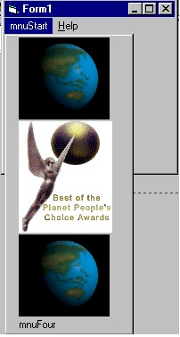

<div align="center">

## Multiple Clickable Bitmaps on a drop menu in a for


</div>

### Description

Very short code! Newly updated and it WORKS! Display bitmaps instead of text on a drop menu, in a form. Use the VB Menu Editor to create a menu with sub menus, the code does the rest!! So easy you will slap yourself for using other people's lengthy drawn-out codes.
 
### More Info
 
Create a form (Form1)

Add a module (Module1)

Add three image controls (Image1, Image2, Image3)

Assign a small BITMAP for each Image Control in

its picture property.

IMPORTANT: You need to create a Menu, so go to

the VB Menu Editor (Ctrl+E) and create a main menu.

Then create 3 Sub Menus. It doesn't matter what you

name any of the menus or menu options because this

code does the work for you.

Copy and paste the API into a Module (Module1)

Copy and paste the rest of the code into

the form (Form1)

Places images onto a menu


<span>             |<span>
---                |---
**Submitted On**   |
**By**             |[Patrick K\. Bigley](https://github.com/Planet-Source-Code/PSCIndex/blob/master/ByAuthor/patrick-k-bigley.md)
**Level**          |Unknown
**User Rating**    |6.0 (600 globes from 100 users)
**Compatibility**  |VB 4\.0 \(32\-bit\), VB 5\.0, VB 6\.0
**Category**       |[Miscellaneous](https://github.com/Planet-Source-Code/PSCIndex/blob/master/ByCategory/miscellaneous__1-1.md)
**World**          |[Visual Basic](https://github.com/Planet-Source-Code/PSCIndex/blob/master/ByWorld/visual-basic.md)
**Archive File**   |[](https://github.com/Planet-Source-Code/patrick-k-bigley-multiple-clickable-bitmaps-on-a-drop-menu-in-a-for__1-1394/archive/master.zip)

### API Declarations

```
Declare Function GetMenu Lib "user32" (ByVal hWnd As Long) As Long
Declare Function GetMenuItemID Lib "user32" (ByVal hMenu As Long, ByVal nPos As Long) As Long
Declare Function GetSubMenu Lib "user32" (ByVal hMenu As Long, ByVal nPos As Long) As Long
Declare Function ModifyMenu Lib "user32" Alias "ModifyMenuA" (ByVal hMenu As Long, ByVal nPosition As Long, ByVal wFlags As Long, ByVal wIDNewItem As Long, ByVal lpString As Any) As Long
'***Part of the bonus code********************************
Declare Function GetSystemMenu Lib "user32" (ByVal hwnd As Long, ByVal bRevert As Long) As Long
'*********************************************************
Global Const MF_BITMAP = 4
```


### Source Code

```
Private Sub Form_Load()
  Dim hMenu As Long, hSubMenu As Long, MenuID As Long
'**************Bonus Code Below*****************************************
'This bonus code adds a bitmap to the form's main drop menu. Click the
'titlebar with the right mouse button to see thr effect.
  hMenu = GetMenu(Form1.hwnd)
  hMenu = GetSystemMenu(hwnd, 0)
  MenuID = 0
  'MenuID = &HF120 'This places the bitmap as first, but looks distorted
          'when the option is not minimized. This is the "restore" option.
X% = ModifyMenu(hMenu, MenuID, MF_BITMAP, MenuID, CLng(Image1.Picture))
'**************Bonus Code above*****************************************
  hMenu = GetMenu(Form1.hwnd)
  hSubMenu = GetSubMenu(hMenu, 0) 'The "0" here is for the first menu Item.
                  'A "1" can be used for the second and a "3"
                  'for the third and so on...
                  'You may not want all menu items to have images
                  'so you can skip a number
  MenuID = GetMenuItemID(hSubMenu, 0) 'The "0" here is for the first SUB menu Item.
                    'A "1" can be used for the second and a "3"
                    'for the third and so on...
                    'You may not want all SUB menu items to have images
                    'so you can skip a number
  X% = ModifyMenu(hMenu, MenuID, MF_BITMAP, MenuID, CLng(Image1.Picture))
  MenuID = GetMenuItemID(hSubMenu, 1)
  X% = ModifyMenu(hMenu, MenuID, MF_BITMAP, MenuID, CLng(Image2.Picture))
  MenuID = GetMenuItemID(hSubMenu, 2)
  X% = ModifyMenu(hMenu, MenuID, MF_BITMAP, MenuID, CLng(Image3.Picture))
'Note: The entire code above can be copied and pasted below with
'different numbers for different menus and sub menus
'REMEMBER, go to the VB Menu editor (Ctrl+E) and create a menu item.
'Then create 3 sub menus. It doesn't matter what you
'name any of the menus or menu options.
'Tip: Bitmaps work best. GIFs that have invisible colors do not appear invisible
'and icon (*.ico) do not work at all. Use Image controls instead
'of Picture controls to save resources.
'Comments to opus@bargainbd.com
'http://bargainbd.com/opusopus/top.htm
End Sub
```

